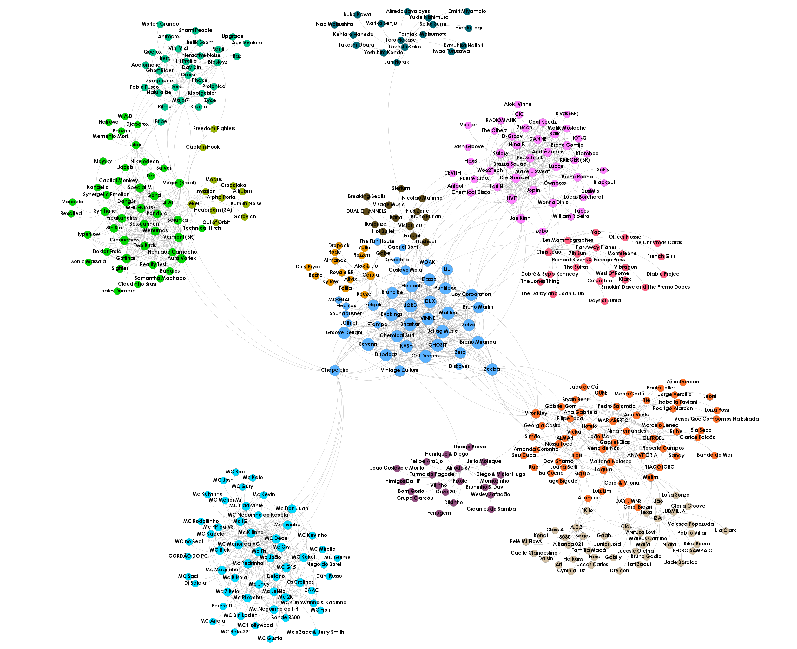

# Visualização de redes de artistas relacionados no Spotify partindo do Vintage Culture

Através do código disponibilizado pelo professor Nazareno Ferreira de Andrade foi feita a coleta de dados do Spotify, partindo do artista *Vintage Culture* para seus artistas relacionados e de cada artista relacionado para os artistas relacionados a eles, por 5 níveis.

Em seguida, os arquivos _.csv_ referentes aos nós e arestas foram importados no software _Gephi_ para a modelagem da visualização da rede. Os tamanhos dos nós foram modelados de acordo com a centralidade de autovetor e coloridos de acordo com as comunidades encontradas pelo algoritmo de modularidade do _Gephi_.

A seguir é possível visualizar o resultado. A única informação disponível sobre os artistas foi a que é dada pelas arestas, ou seja, se há uma aresta partindo de um artista para outro, significam que esses artistas são relacionados de acordo com os hábitos dos ouvintes. No entanto, após aplicar na rede as estatísticas citadas anteriormente, notou-se semelhanças de gênero musical em cada comunidade. É possível notar uma distinção de vertentes da própria música eletrônica, assim como outros gêneros como _Funk_, _Pagode_, _Sertanejo_ e _Pop_. Também é interessante notar quais são os artistas que serviram de ponte para as outras comunidades, como o _Chapeleiro_, que tem como artistas relacionados alguns nomes do _Funk_ e do _Trance Brasileiro_, assim como o _Liu_, que tem como artista relacionado _Takashi Kako (anime score, japanese soundtrack)_, explicando o surgimento dessas comunidades na rede.

